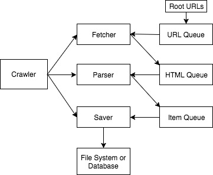

## MyCrawler

MyCrawler is an async web crawler using coroutines. It minized the wait for I/O operations in URL requests and result persistance. It is able to fetch, parse and save the content of around 1800 pages of xkcd.com in 30 seconds, with a 2.5GHz i5 macbook and public WIFI.



### Project Description

Features:
- Single thread for each process, async/await for coroutine. No GIL, no callbacks of callbacks.
- Use (url, redirect_left, depth) to avoid multiple URLs redirecting to the same end URL, if the redirects are handled by web server.
- Use set or Bloom Filter for URL filtering.

Structure:
- The ```crawler.py``` is the main class, which will take Fetcher, Parser and Saver and manage the high-level crawling logic.
- The ```workers``` directory contains the classes that do their own tasks.
- The ```utils``` directory contains utitily functions that is relatively stable and orthogonal to the logic of their own class.

Constraints:
- Fetcher: I/O bound, one process, many coroutines.
- Parser: CPU bound, number of process depending on the workload of parsing.
- Saver: I/O bound, one process, many coroutines.

The Fetcher, Parser Saver classes are not necessarily needed, since a coroutines triggered is able to store its state in local variables like a function does. In fact, function is a special case of coroutine. But for the more separated code, those functions are wrapped into classes.

There's still much room for improvement, since there's no HTML queue for Parser and item queue for Save, which allows parsers and savers to work independently without switching context.

#### How coroutines are used to minimize wait on I/O 

1. asyncio.Task(coro) wraps the coroutine in a future, and there will only be one task running in one event loop.
```python
tasks_list = [asyncio.Task(self._work(index + 1), loop=self._loop)
              for index in range(self._num_fetchers)]
```

2. inside of _work(), fetch() is called, that coroutine will be suspended on the line below
```python
fetch_status, fetch_result = await self._fetcher.fetch(url, redirects, depth)
```

3. inside of fetch(), use the session provided by aiohttp to get response, similarly, that coroutine will be suspended on the line below
```python
response = await self._session.get(
    url, allow_redirect=False, timeout=5
)
```

4. after fetch_result is retrieved, it will be passed to parser, and the task will be suspended until .parse() finishes
```python
# fetch_result => (response status, url, response_text)
parse_status, url_list, item = await self._parser.parse(url, depth, fetch_result[-1])
```

5. after item is parsed, it will be passed to saver and the task will be suspended until .save() finishes
```python
await self._saver.save(url, item)
```

#### Tests

by crawling sites
  - use default settings

by querying DB
  - to be implemented
  - seprate client / server network environment
  - use aiomysql to manage connection pool (set to 10 for testing)
  - run aiohttp on gunicorn, set workers to be 5

by calling API
  - to be implemented

### Future Features

1. Items able to be saved to DB.
2. Redis for better URL queue, HTML queue and item queue.
3. Multiple processes on different machines, making it a distributed crawler.
